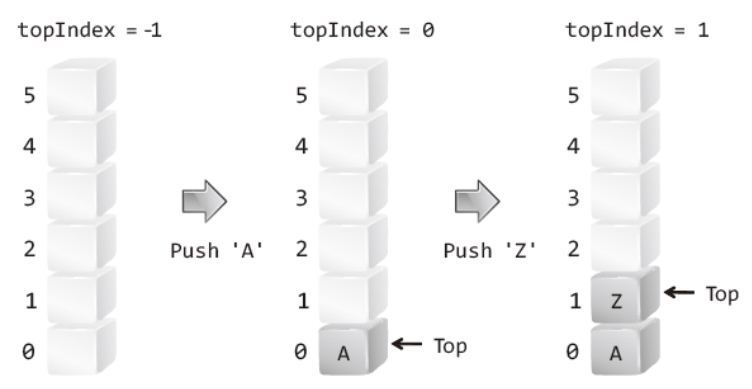
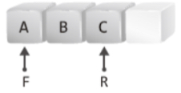

# 자료 구조

선형 자료구조 : 데이터를 선의 형태로 나란히, 혹은 일렬로 저장하는 구조 
비선형 자료구조 : 데이터를 나란히 저장하지 않는 구조

[EX] 
**선형 구조 : 리스트, 스택, 큐 
비선형 구조 : 트리 (이진 트리, 이진 탐색 트리, AVL 트리), 힙, 우선 순위 큐, 맵, 셋, 해시 테이블**

**알고리즘은 자료구조에 의존적이며, 서로 밀접한 관계를 가진다.**

## 시간 복잡도와 공간 복잡도

**시간 복잡도** : 속도와 관련된 알고리즘의 수행 시간, **어떠한 알고리즘의 로직이 '얼마나 오랜 시간'이 걸리는지** 나타내는 데에 사용된다. 
-> 비교 연산의 횟수가 적은 알고리즘이 시간 복잡도가 작다고 볼 수 있다.

**공간 복잡도** : 메모리 사용량에 관련된 분석 결과, **'프로그램을 실행시켰을 때 필요로 하는 자원 공간의 양'**을 나타내는 데에 사용된다. 

## 자료 구조의 시간 복잡도

| Data Structures     |Average Case         |                     |                     | Worst Case          |                      |                     |
|---------------------|----------------------|---------------------|---------------------|---------------------|---------------------|---------------------|
|                     | Search              | Insert              | Delete              | Search              | Insert              | Delete              |
| Array               | O(n)                | O(n)                 | O(n)                 | O(n)                | O(n)                 | O(n)                 |
| Sorted Array        | O(log n)            | O(n)                | O(n)                | O(log n)            | O(n)                | O(n)                |
| Linked List         | O(n)                | O(1)                | O(1)                | O(n)                | O(1)                | O(1)                |
| Doubly Linked List  | O(n)                | O(1)                | O(1)                | O(n)                | O(1)                | O(1)                |
| Stack               | O(n)                | O(1)                | O(1)                | O(n)                | O(1)                | O(1)                |
| Queue               | O(n)                | O(1)                | O(1)                | O(n)                | O(1)                | O(1)                |
| Hash Table          | O(1)                | O(1)                | O(1)                | O(n)                | O(n)                | O(n)                |
| Binary Search Tree  | O(log n)            | O(log n)            | O(log n)            | O(n)                | O(n)                | O(n)                |
| Red-Black Tree      | O(log n)            | O(log n)            | O(log n)            | O(log n)            | O(log n)            | O(log n)            |
| AVL Tree            | O(log n)            | O(log n)            | O(log n)            | O(log n)            | O(log n)            | O(log n)            |

 

# 선형 자료구조

## 배열
정적 배열 : 같은 타입의 변수들, 크기가 정해져 있음, 인접한 메모리 위치에 있는 데이터를 모안호은 집합, 중복을 허용하고 순서가 있는 자료구조. (**삽입과 삭제 : O(n), 탐색 : O(1)**)

## 리스트

리스트 : 데이터를 나란히 저장하며, **중복이 되는 데이터의 저장**을 허용하는 자료구조. 

순차 리스트 : **배열을 기반**으로 구현된 리스트이며, 동적 크기 조정이 가능하다. **EX) C++의 vector** ; (**삽입과 삭제 : O(n), 탐색 : O(1)**) 
연결 리스트 : **메모리의 동적 할당**을 기반으로 구현된 리스트이며, 싱글 연결 리스트, 원형 연결 리스트, 양방향 연결 리스트가 존재 (**삽입과 삭제 : O(1), 탐색 : O(n)**)

**데이터 추가와 삭제를 많이 할 때에는 연결 리스트를, 탐색을 많이 할 때에는 순차 리스트를 사용하는 것이 좋다.**

### 싱글 연결 리스트

next 포인터만 가짐.

### 양방향 연결 리스트

next + prev 포인터를 가짐.

### 원형 연결 리스트

원형 연결 리스트는 단순 연결 리스트와 다르게 머리와 꼬리를 가리키는 포인터 변수를 따로 두지 않아도, 즉 **하나의 포인터 변수만 있어도** 머리 또는 꼬리에 노드를 간단히 추가할 수 있음.

꼬리를 가르키는 포인터 변수 : tail 
머리를 가르키는 포인터 변수 : tail->next

## 벡터
동적으로 요소를 할당할 수 있는 동적 배열. 중복을 허용, 순서가 있다. (**탐색, 맨 뒤의 요소의 삽입과 삭제 : O(1), 맨 뒤나 맨 앞이 아닌 요소의 삽입과 삭제 : O(n)**)

대표적인 함수 : push_back(), pop_back(), erase(), find(), clear()

## 스택

**후입선출 (LIFO) 형태**의 자료구조로, 배열, 연결 리스트의 형태 모두 구현 가능하다. (**삽입과 삭제 : O(1), 탐색 : O(n)**) 
C++의 STL(Standard Template Library)에서 stack 함수를 제공해 준다.

대표적인 함수 : push(), pop(), top(), size(), empty(), swap()

~~~
#include <iostream>
#include <stack>
using namespace std;

int main(void) {

	stack<int> st;
	stack<int> st2;

	st.push(1);
	st.push(2);
	st.push(3);

	st2.push(10);
	st2.push(20);
	st2.push(30);

	swap(st, st2);

	while (!st.empty()) {
		cout << st.top() << endl;
		st.pop();
	}

	return 0;
}
~~~

스택 활용 분야 : 뒤로 가기 (웹 브라우저), 후위 표기법, **DFS(너비 우선 탐색)** ...등등

수식 표기법 : 중위, 전위, 후위 표기법 
중위 표기법 : 5 + 2 / 7 
전위 표기법 : + 5 / 2 7 
후위 표기법 : 5 2 7 / +

전위 표기법과 후위 표기법의 수식 자체에 **연산순서의 정보**가 들어있다, 따라서 **연산자의 우선 순위**를 알 필요가 없으며, 중위 표기법과 다르게 소괄호에 대한 처리도 불필요하다.

## 큐

### 선형 큐

 
큐의 꼬리가 가르키는 포인터가 배열의 마지막 인덱스를 가르키고 있을 때 앞쪽에서 Dequeue로 발생한 배열의 비어있는 공간을 활용 할 수 없는 문제가 발생 -> 원형 큐의 등장

### 원형 큐

 큐가 비어있는 상태 (front == rear)과 큐가 가득 찬 상태를 구별하기 위해 원형 큐의 한 칸은 비워 두어야 한다.

**선입선출 (FIFO) 형태**의 자료구조로, 배열, 연결 리스트의 형태 모두 구현 가능하다. (**삽입과 삭제 : O(1), 탐색 : O(n)**)

큐의 기본 연산 :
1. enqueue() : 큐에 데이터를 넣는 연산 ; 큐의 꼬리를 한 칸 이동시키고 그 자리에 새로운 데이터를 저장
2. dequeue() : 큐에서 데이터를 꺼내는 연산 ; 큐의 머리가 가리키는 데이터를 반환하고 큐의 머리를 한 칸 이동

대표적인 함수 : push(), pop(), front(), back(), size(), empty(), swap()

~~~
#include <iostream>
#include <queue>
using namespace std;

int main()
{ 
    queue<int> q1;
    queue<int> q2;

    q1.push(1);
    q1.push(2);
    q1.push(3);

    q2.push(10);
    q2.push(20);
    q2.push(30);

    swap(q1, q2);

    while (!q1.empty())
    {
        cout << q1.front() << endl;
        q1.pop();
    }

    return 0;
}
~~~

큐 활용 분야 : CPU 작업을 기다리는 프로세스, 스레드 행렬 or 네트워크 접속을 기다리는 행렬, **너비 우선 탐색(DFS)**

 

# 비선형 자료구조